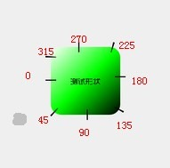

# android shape 使用

> - 作用：`XML中定义的几何形状`
> - 位置：`res/drawable/文件的名称.xml`
> - 使用的方法：`Java代码中：R.drawable.文件的名称`
> - XML中：`android:background="@drawable/文件的名称"`

属性：
```xml
    <shape xmlns:android="http://schemas.android.com/apk/res/android"
     android:shape=" rectangle | oval | line | ring " >

     …………

     </shape>
```

> **其中rectangle矩形，oval椭圆，line水平直线，ring环形,默认为 rectangle **

**\<shape>**中子节点的常用属性：

- [1.\<gradient> 渐变](#1)
- [2.\<solid> 填充](#2)
- [3.\<stroke> 描边](#3)
- [4.\<corners> 圆角](#4)
- [5.\<padding> 间隔](#5)
- [6.\<size> ](#6)

- - -

## <p id="1">1. \<gradient> 渐变</p>

### 属性:

| 属性 | 介绍 | 数据类型(可选参数) |
|---|---|---|
| angle          | 旋转角度 | 45的倍数,整形 |
| centerX        | 中心位置,X向偏移 | (左)0 ~ 1(右) |
| centerY        | 中心位置,Y向偏移 | (上)0 ~ 1(下) |
| centerColor    | 中心颜色 | int \ color  |
| startColor     | 起始颜色 | int \ color  |
| endColor       | 结束颜色 | int \ color  |
| gradientRadius | 圆的大小(radial时有效) | dimensions |
| type           | 渐变类型 | linear(线性) \ radial(同心圆) \ sweep(扇形扫面线) |
| useLevel       | 是否用作水平可拉的列表(暂时未定) | boolean |

angle 值对应图



### 示例:

```xml
<gradient
        android:centerColor="#cc730a99"
        android:centerX="0.5"
        android:centerY="0.5"
        android:endColor="#ffffff"
        android:gradientRadius="10dp"
        android:startColor="#000000"
        android:type="linear"/>
```

- - -

## <p id="2">2.\<solid> 填充</p>

### 属性:

| 属性 | 介绍 | 数据类型(可选参数) |
|---|---|---|
| color | 填充颜色 | int \ color  |

### 示例:

```xml
<solid android:color="#777" />
```

- - -

## <p id="3">3.\<stroke> 描边</p>

### 属性


| 属性 | 介绍 | 数据类型(可选参数) |
|---|---|---|
| color | 填充颜色 | int \ color  |
| width | 边条宽度 | int \ dimensions  |
| dashWidth | 虚线"-"宽度 | int \ dimensions  |
| dashGap | 虚线"-"间距 | int \ dimensions   |

> dash 的两个属性可将边框变为虚线型
> 其中android:dashWidth表示'-'这样一个横线的宽度,android:dashGap表示之间隔开的距离。


### 示例:

```xml
    <stroke
        android:color="@android:color/holo_blue_light"
        android:width="50dp"
        android:dashWidth="100dp"
        android:dashGap="55dp"/>
```

- - -

## <p id="4">4.\<corners> 圆角</p>

### 属性:

> **shape=“rectangle”时使用**
> 数据类型为整形, dimensions

| 属性 | 介绍 |
|---|---|
| radius | 一次性定义四个圆角的半径,会被覆盖.默认为1dp|
| topLeftRadius     | 左上角的圆弧半径 |
| topRightRadius    | 右上角的圆弧半径 |
| bottomLeftRadius  | 左下角的圆弧半径 |
| bottomRightRadius | 右下角的圆弧半径 |

### 示例:

```xml
<corners
        android:radius="20dp"
        android:topLeftRadius="10dp"
        android:topRightRadius="10dp"
        android:bottomLeftRadius="10dp"
        android:bottomRightRadius="10dp"
        />
```

- - -

## <p id="5">5.\<padding> 间隔</p>

### 属性

> 与边界的距离
> 数据类型皆为 dimensions

| 属性 | 介绍 |
|---|---|
| top | 距离上边界 |
| bottom | 距离下边界 |
| left | 距离左边界 |
| right | 距离右边界 |

### 示例

```xml
<padding
        android:bottom="10dp"
        android:left="10dp"
        android:right="10dp"
        android:top="10dp"/>

```

> 一般用不到,与 `Android:padding_top="10dp"` 等相同

- - -

## <p id="6">6.\<size> </p>

### 属性
> 设置界面大小
> 数据类型皆为 dimensions

| 属性 | 介绍 |
|---|---|
| width | 画布宽度 |
| height | 画布高度 |

- - -

## ~end~