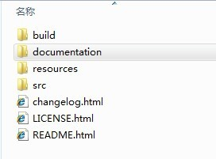
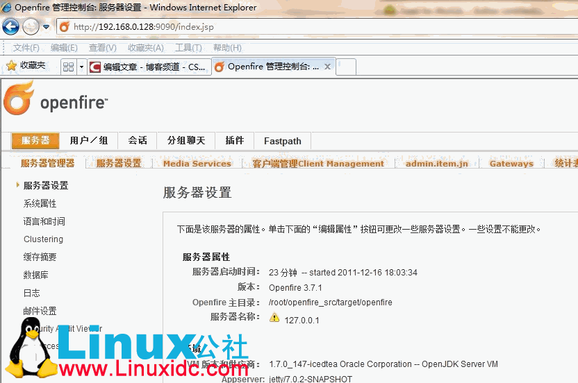
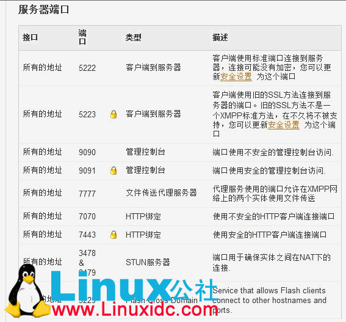
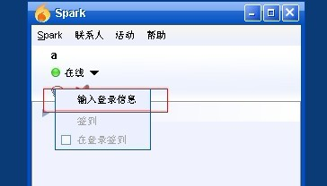

# 搭建开源的 IM 即时通讯服务器

## 目录

 - [1. 构成](#1)
 - [2. dsjfads](#2)


### <p id='1' />1.构成

> 取自:`http://www.linuxidc.com/Linux/2011-12/49668.htm`

用mysql+openfire+spark搭建开源IM系统

|软件|用处|
|---|---|
|mysql|数据库，用于存储信息|
|openfire|XMPP协议服务器，实现了XMPP协议|
|spark|客户端|

> 注(百度百科): Openfire 采用Java开发，开源的实时协作（RTC）服务器基于XMPP（Jabber）协议。
> Openfire安装和使用都非常简单，并利用Web进行管理。单台服务器可支持上万并发用户。


### 环境：

root@Ubuntu:~# uname -a
Linux ubuntu 3.0.0-12-generic #20-Ubuntu SMP Fri Oct 7 14:50:42 UTC 2011 i686 i686 i386 GNU/Linux

jdk7

openfire3.7.1

mysql：Server version: 5.1.58-1ubuntu1 (Ubuntu)


### 服务器搭建：

下载openfire源码，解压后的目录结构：



//帮助文档在：documentation\docs\index.html


## 1、安装 openfire

### 1.1、安装数据库（以mysql为例）

> ubuntu默认没有安装mysql.你只要 apt-get install mysql.就可以下载和安装了。
> 你可以下载mysql源码进行编译安装。<br/>
> 安装后常见的问题：

A、防火墙打开，解决方法是关闭防火墙，或者打开相应的端口（见后面端口列表）

B、其它机器不能访问mysql，解决方法，新增加用户，让此用户能从其它机器访问。

##### 其一：

mysql>GRANT ALL PRIVILEGES ON xoops.* TO xoops_root@"%" IDENTIFIED BY "password";

允许xoops_root用户可以从任意机器上登入MySQL。

##### 其二：

$sudo gedit /etc/mysql/my.cnf

老的版本中

> skip-networking => # skip-networking

新的版本中

> bind-address=127.0.0.1 => bind-address= 你机器的IP 或者去掉此行。

这样就可以允许其他机器访问MySQL了。


#### 1.1.1、建立库表：

#mysqladmin create [databaseName]

databaseName:是数据库名。

#### 1.1.2、导入库表，安装目录/resources/database :
Unix/Linux: cat openfire_mysql.sql | mysql [databaseName];
Windows: type openfire_mysql.sql | mysql [databaseName];


### 1.2、编译openfire

#### 1.2.1、安装并设置 jdk，本人用的是 jdk7

export $JAVA_HOME=/usr/lib/jvm/java-7-openjdk-i386
#### 1.2.2、安装并设置 ant
#### 1.2.3、开始编译openfire

> - 进入源码目录下的/build
> - #ant
> - 搞定编译完成。openfire核心编译完成。
> - 程序会产生在源码目录下的 target 目录下
> - 如果要插件的话(比如IM网关），则要编译插件：

#ant plugins

> - 编译完成，所有插件被放到源码目录下的target/openfire/plugins

#### 1.2.4、可能出现的问题。

由于我用的是jdk7的版本，openfire3.7是只支持jdk5和jdk6，所以在编译时会提示jdk错误。你只要在build.xml文件中增加下面红色部分就可以解决。
```xml
<condition property="java.not.ok" value="true">
            <not>
                <or>
                    <contains string="${ant.java.version}" substring="1.5"/>
                    <contains string="${ant.java.version}" substring="1.6"/>
                    <contains string="${ant.java.version}" substring="1.7"/>
                </or>
            </not>
        </condition>
```

#### 1.2.5、配置

> - conf/openfire.xml
```xml
  <connectionProvider>
    <className>org.jivesoftware.database.DefaultConnectionProvider</className>
  </connectionProvider>
  <database>
    <defaultProvider>
      <driver>com.mysql.jdbc.Driver</driver>
      <serverURL>jdbc:mysql://localhost:3306/openfire</serverURL>
      <username>root</username>
      <password/>
      <testSQL>select 1</testSQL>
      <testBeforeUse>true</testBeforeUse>
      <testAfterUse>true</testAfterUse>
      <minConnections>5</minConnections>
      <maxConnections>25</maxConnections>
      <connectionTimeout>1.0</connectionTimeout>
    </defaultProvider>
  </database>
```

### 1.3、运行

#### 1.3.1、未安装运行

> - 在源码目录下的/build 下运行
> - #ant run
> - 就可以运行openfire了
> - root@ubuntu:~/openfire_src/build# ant run
> - Buildfile: /root/openfire_src/build/build.xml

    run:

        - [java] Listening for transport dt_socket at address: 8000
        - [java] Openfire 3.7.1 [2011-12-13 2:47:08]
        - [java] 管理平台开始监听:
        - [java]   http://127.0.0.1:9090
        - [java]   https://127.0.0.1:9091


#### 1.3.2、安装后运行

\# /etc/init.d/openfire
Usage /etc/init.d/openfire {start|stop|restart|status|condrestart|reload}

\# /etc/init.d/openfire start
Starting openfire:

### 1.4、配置

> 访问：  http://127.0.0.1:9090 就可以配置 openfire




网关配置：

现在可以支持msn、gtalk、icq等，qq、人人网等属于试验型的。但我测试没有通过。

选中你要的网关类型，点测试，看是否能成功，如果成功，则表示可以通信。我测试msn可以测试通过，但是客户端不能在msn注册。测试gtalk可以成功，也可以登录。好象gtalk服务器也是基于xmpp的，端口也是用的5222


 建立一个账户 a


## 2、安装spark

windows7旗舰版


jdk7

spark2.6.3

2.1、spark下载

spark安装包有两种，一个带jdk的，一个不带jdk的，下载带jdk的，双击安装即可


登录后在工具栏上会出现gtalk的图标


把a账户与gtalk账户进行绑定



输入gtalk账户


gtalk账户登录成功


好了，现在可以自由的与gtalk通信了。
